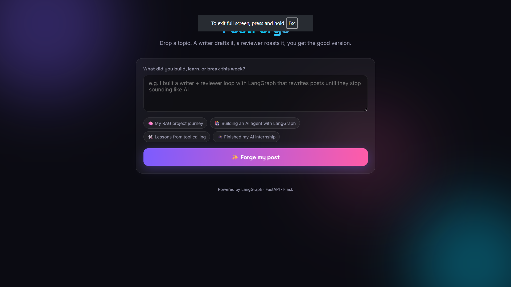

# 🤖 LinkedIn Agentic Post Writer

An agentic AI application for generating and reviewing LinkedIn posts using **LangGraph**, **OpenAI**, and **Tavily**.


## 🌐 Live Demo

[https://linkedin-agentic-post-writer-production.up.railway.app/](https://linkedin-agentic-post-writer-production.up.railway.app/)

## 📸 Screenshot



## ✨ Features

- 📝 Generate LinkedIn posts from a topic
- 🔎 Tavily web search when external information is needed
- 🧠 LangGraph-based agent workflow
- ✍️ AI writer node
- 🔍 Structured reviewer node
- 🔄 Iterative writer → reviewer workflow
- 🛑 Maximum-attempt safeguard
- 🌐 Flask web interface
- ⚡ FastAPI backend
- 🐳 Dockerized services
- 🚀 Railway deployment

## 🏗️ Architecture

```text
User
  │
  ▼
┌─────────────┐
│  Flask UI   │
└──────┬──────┘
       │
       ▼
┌──────────────┐
│ FastAPI API  │
└──────┬───────┘
       │
       ▼
┌──────────────┐
│  LangGraph   │
│    Agent     │
└──────┬───────┘
       │
   ┌───┴───────────┐
   ▼               ▼
Writer          Tavily
   │             Search
   ▼
Draft
   │
   ▼
Reviewer
   │
   ├── Approved ──► END
   │
   └── Revise ────► Writer
```

## 🔄 Workflow

1. **Writer** generates the LinkedIn post.
2. **Tools** executes Tavily search when required.
3. **Extract Draft** prepares the generated post for review.
4. **Reviewer** evaluates the draft using structured output.
5. **Router** either ends the workflow or sends the post back to the writer for revision.

## 🛠️ Tech Stack

| Technology | Purpose |
|---|---|
| Python | Core application |
| LangGraph | Agent workflow orchestration |
| LangChain | LLM/tool integration |
| OpenAI | Language model |
| Tavily | Web search |
| FastAPI | Backend API |
| Flask | Web UI |
| Uvicorn | FastAPI server |
| Gunicorn | Flask production server |
| Docker | Containerization |
| Railway | Deployment |

## 📁 Project Structure

```text
LINKDIN-POST_REVIEWER/
│
├── FastAPI Backend Service/
│   ├── backend.py
│   ├── project.py
│   ├── Dockerfile
│   └── requirements.txt
│
├── Flask UI Service/
│   ├── app.py
│   ├── Dockerfile
│   └── requirements.txt
│
├── .gitignore
├── .dockerignore
├── README.md
└── requirements.txt
```

## ⚙️ Environment Variables

Backend:

```env
OPENAI_API_KEY=your_openai_api_key
TAVILY_API_KEY=your_tavily_api_key
```

Flask UI:

```env
BACKEND_URL=http://your-backend-url
```

**Never commit `.env` or API keys to GitHub.**

## 🚀 Run Locally

### Backend

```bash
cd "FastAPI Backend Service"
pip install -r requirements.txt
uvicorn backend:api --host 0.0.0.0 --port 8000
```

### Flask UI

Open another terminal:

```bash
cd "Flask UI Service"
pip install -r requirements.txt
```

Set:

```env
BACKEND_URL=http://127.0.0.1:8000
```

Then:

```bash
python app.py
```

Open:

```text
http://127.0.0.1:5000
```

## 🐳 Docker

### Flask UI

```bash
cd "Flask UI Service"
docker build -t linkedin-flask-ui .
docker run -p 5000:5000 linkedin-flask-ui
```

### FastAPI Backend

```bash
cd "FastAPI Backend Service"
docker build -t linkedin-fastapi-backend .
docker run -p 8000:8000 linkedin-fastapi-backend
```

## ☁️ Railway Deployment

The project is designed as two Railway services:

```text
Railway Project
│
├── Flask UI Service
│   └── Root Directory: /Flask UI Service
│
└── FastAPI Backend Service
    └── Root Directory: /FastAPI Backend Service
```

Each service has its own Dockerfile and dependencies.

## 🎯 What This Project Demonstrates

- Agentic AI workflows
- LangGraph state-based orchestration
- Tool calling
- Web search integration
- Structured reviewer output
- Iterative generation and feedback
- Flask + FastAPI architecture
- Docker containerization
- Railway deployment

## 👨‍💻 Author

**Dharmesh Sharma**

B.Tech Artificial Intelligence Student

GitHub: https://github.com/dharmeshsharma8085

---

⭐ If you find this project useful, consider giving the repository a star.
